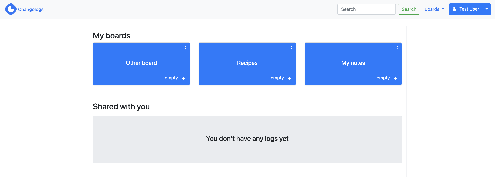
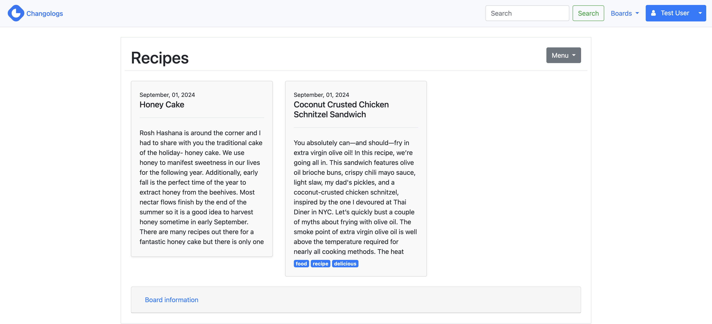

# Changologs
An application for saving simple but useful notes

## Features
* Authentication
* Add boards
* Add logs within boards
* Profile
* Send emails when adding or removing logs
* Share boards with other people
* Sentiment analysis for Daily Log boards
* 2FA

## How to run it
* `bundle install`: Install dependencies
* `rails db:create`: Create database
* `rails db:migrate`: Run migrations
* `rails server`: Run the application

## Screenshots

## Demo app
[changologs.com](https://changologs.com)

Created with love by Jorge Chávez
